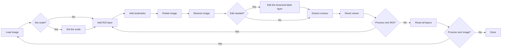

# Leaf Shape Analysis Tool

[Japanese Page is HERE | 日本語のREADMEはこちら](README_ja.md)

A napari-based graphical user interface (GUI) for fully reproducible extraction, orientation, and morphometric analysis of leaf outlines.
This tool enables users to perform each processing step interactively—from setting image scale to computing normalized Elliptic Fourier Descriptors (EFDs)—within a single environment.

## Key Features

| Step | Widget                                         | Description                                                                                                                                           |
| ---- | ---------------------------------------------- | ----------------------------------------------------------------------------------------------------------------------------------------------------- |
| 1️⃣  | **Set Scale** (`set_scale.py`)                 | Define the physical scale of images using either DPI or a measured reference line (mm/cm/µm). Updates all visible layers and napari’s scale bar.      |
| 2️⃣  | **Crop ROI** (`crop_rectangle.py`)             | Define rectangular/polygonal regions of interest (ROIs) interactively and crop them. Generates numbered ROI layers and corresponding landmark layers. |
| 3️⃣  | **Point Tools** (`make_points_tool_widget.py`) | Add and label landmark points (e.g., *base* and *tip*) for each ROI. Supports auto-advancing label assignment, undo, and count display.               |
| 4️⃣  | **Rotate Image** (`rotate_image.py`)           | Rotate each ROI image based on base–tip landmarks so that the biological orientation (base → tip) is consistently rightward.                          |
| 5️⃣  | **Binarize Image** (`binarize_image.py`)       | Generate binary masks using Otsu thresholding or SAM2 segmentation. Metadata (thresholds, methods, manual edits) are preserved.                       |
| 6️⃣  | **Extract Contour** (`extract_contour.py`)     | Extract the largest external contour, visualize it, and export coordinates (CSV) and structured metadata (JSON/CSV).                                  |
| 7️⃣  | **Compute EFDs** (`calculate_efd.py`)          | Calculate Elliptic Fourier Descriptors (EFDs), including *true normalization* (Wu et al. 2024), and export coefficients to CSV.                       |
| 8️⃣  | **Clear Viewer** (`clear_viewer.py`)           | Reset the viewer safely while preserving base images or ROIs, with optional automatic screenshot export.                                              |

## Workflow Overview



## Quick Start (for experienced users)

```bash
uv venv
.venv\Scripts\activate # source .venv/bin/activate  # for macOS/Linux
uv sync
uv run python -m leaf_shape_tool.main
```

または、開発中は

```bash
uv pip install -e .
leaf-shape-tool
``` 

でインストールできます。

## Citation

## Acknowledgements

Built on the open-source frameworks [napari](https://napari.org/stable/), magicgui, OpenCV, and pandas.
We thank the developers and the open science community for making this ecosystem possible.

windows

```powershell
uv venv
.venv\Scripts\activate
uv sync
```
